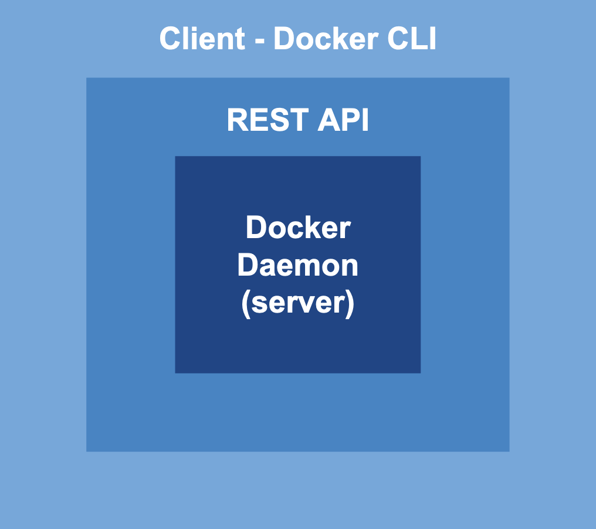

# What is Docker?

Docker is a platform that provides the ability to create, run, and manage containers. 

The Docker Engine is the containerization technology for building and containerizing applications. It’s the “brain” of the Docker platform. It is responsible for creating isolated environments and running processes in them.

The Docker Engine acts as a client-server application with:

- **A server with a daemon process (`dockerd`):** This process listens to the API requests and manages Docker objects such as images, containers, networks, and volumes. It is also responsible for pulling and pushing images.
- **A REST API:** This is an HTTP API that the Docker client uses to communicate with the Docker Engine. Check out the API reference [here](https://docs.docker.com/engine/api/v1.41/#).
- **A CLI client (`docker`):** This is the primary way for interacting with Docker. When commands such as `docker images` are run they’re sent to `dockerd` which executes the commands.